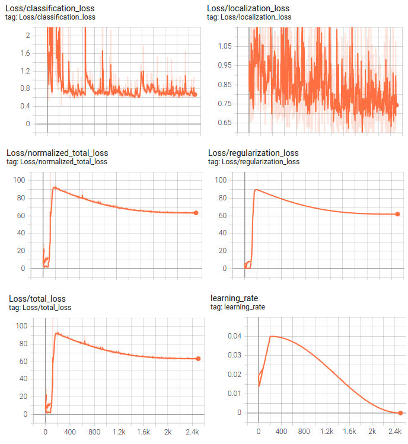

# Object Detection in an Urban Environment

## Data

For this project, we will be using data from the [Waymo Open dataset](https://waymo.com/open/).

[OPTIONAL] - The files can be downloaded directly from the website as tar files or from the [Google Cloud Bucket](https://console.cloud.google.com/storage/browser/waymo_open_dataset_v_1_2_0_individual_files/) as individual tf records. We have already provided the data required to finish this project in the workspace, so you don't need to download it separately.

## Structure

### Data

The data you will use for training, validation and testing is organized as follow:
```
/home/workspace/data/waymo
    - training_and_validation - contains 97 files to train and validate your models
    - train: contain the train data (empty to start)
    - val: contain the val data (empty to start)
    - test - contains 3 files to test your model and create inference videos
```

The `training_and_validation` folder contains file that have been downsampled: we have selected one every 10 frames from 10 fps videos. The `testing` folder contains frames from the 10 fps video without downsampling.

You will split this `training_and_validation` data into `train`, and `val` sets by completing and executing the `create_splits.py` file.

### Experiments
The experiments folder will be organized as follow:
```
experiments/
    - pretrained_model/
    - exporter_main_v2.py - to create an inference model
    - model_main_tf2.py - to launch training
    - reference/ - reference training with the unchanged config file
    - experiment0/ - create a new folder for each experiment you run
    - experiment1/ - create a new folder for each experiment you run
    - experiment2/ - create a new folder for each experiment you run
    - label_map.pbtxt
    ...
```

## Prerequisites

### Local Setup

For local setup if you have your own Nvidia GPU, you can use the provided Dockerfile and requirements in the [build directory](./build).

Follow [the README therein](./build/README.md) to create a docker container and install all prerequisites.

### Download and process the data

**Note:** ”If you are using the classroom workspace, we have already completed the steps in the section for you. You can find the downloaded and processed files within the `/home/workspace/data/preprocessed_data/` directory. Check this out then proceed to the **Exploratory Data Analysis** part.

The first goal of this project is to download the data from the Waymo's Google Cloud bucket to your local machine. For this project, we only need a subset of the data provided (for example, we do not need to use the Lidar data). Therefore, we are going to download and trim immediately each file. In `download_process.py`, you can view the `create_tf_example` function, which will perform this processing. This function takes the components of a Waymo Tf record and saves them in the Tf Object Detection api format. An example of such function is described [here](https://tensorflow-object-detection-api-tutorial.readthedocs.io/en/latest/training.html#create-tensorflow-records). We are already providing the `label_map.pbtxt` file.

You can run the script using the following command:
```
python download_process.py --data_dir {processed_file_location} --size {number of files you want to download}
```

You are downloading 100 files (unless you changed the `size` parameter) so be patient! Once the script is done, you can look inside your `data_dir` folder to see if the files have been downloaded and processed correctly.

### Classroom Workspace

In the classroom workspace, every library and package should already be installed in your environment. You will NOT need to make use of `gcloud` to download the images.

## Instructions

### Exploratory Data Analysis

You should use the data already present in `/home/workspace/data/waymo` directory to explore the dataset! This is the most important task of any machine learning project. To do so, open the `Exploratory Data Analysis` notebook. In this notebook, your first task will be to implement a `display_instances` function to display images and annotations using `matplotlib`. This should be very similar to the function you created during the course. Once you are done, feel free to spend more time exploring the data and report your findings. Report anything relevant about the dataset in the writeup.

Keep in mind that you should refer to this analysis to create the different spits (training, testing and validation).


### Create the training - validation splits
In the class, we talked about cross-validation and the importance of creating meaningful training and validation splits. For this project, you will have to create your own training and validation sets using the files located in `/home/workspace/data/waymo`. The `split` function in the `create_splits.py` file does the following:
* create three subfolders: `/home/workspace/data/train/`, `/home/workspace/data/val/`, and `/home/workspace/data/test/`
* split the tf records files between these three folders by symbolically linking the files from `/home/workspace/data/waymo/` to `/home/workspace/data/train/`, `/home/workspace/data/val/`, and `/home/workspace/data/test/`

Use the following command to run the script once your function is implemented:
```
python create_splits.py --data-dir /home/workspace/data
```

### Edit the config file

Now you are ready for training. As we explain during the course, the Tf Object Detection API relies on **config files**. The config that we will use for this project is `pipeline.config`, which is the config for a SSD Resnet 50 640x640 model. You can learn more about the Single Shot Detector [here](https://arxiv.org/pdf/1512.02325.pdf).

First, let's download the [pretrained model](http://download.tensorflow.org/models/object_detection/tf2/20200711/ssd_resnet50_v1_fpn_640x640_coco17_tpu-8.tar.gz) and move it to `/home/workspace/experiments/pretrained_model/`.

We need to edit the config files to change the location of the training and validation files, as well as the location of the label_map file, pretrained weights. We also need to adjust the batch size. To do so, run the following:
```
python edit_config.py --train_dir /home/workspace/data/train/ --eval_dir /home/workspace/data/val/ --batch_size 2 --checkpoint /home/workspace/experiments/pretrained_model/ssd_resnet50_v1_fpn_640x640_coco17_tpu-8/checkpoint/ckpt-0 --label_map /home/workspace/experiments/label_map.pbtxt
```
A new config file has been created, `pipeline_new.config`.

### Training

You will now launch your very first experiment with the Tensorflow object detection API. Move the `pipeline_new.config` to the `/home/workspace/experiments/reference` folder. Now launch the training process:
* a training process:
```
python experiments/model_main_tf2.py --model_dir=experiments/reference/ --pipeline_config_path=experiments/reference/pipeline_new.config
```
Once the training is finished, launch the evaluation process:
* an evaluation process:
```
python experiments/model_main_tf2.py --model_dir=experiments/reference/ --pipeline_config_path=experiments/reference/pipeline_new.config --checkpoint_dir=experiments/reference/
```

**Note**: Both processes will display some Tensorflow warnings, which can be ignored. You may have to kill the evaluation script manually using
`CTRL+C`.

To monitor the training, you can launch a tensorboard instance by running `python -m tensorboard.main --logdir experiments/reference/`. You will report your findings in the writeup.

### Improve the performances

Most likely, this initial experiment did not yield optimal results. However, you can make multiple changes to the config file to improve this model. One obvious change consists in improving the data augmentation strategy. The [`preprocessor.proto`](https://github.com/tensorflow/models/blob/master/research/object_detection/protos/preprocessor.proto) file contains the different data augmentation method available in the Tf Object Detection API. To help you visualize these augmentations, we are providing a notebook: `Explore augmentations.ipynb`. Using this notebook, try different data augmentation combinations and select the one you think is optimal for our dataset. Justify your choices in the writeup.

Keep in mind that the following are also available:
* experiment with the optimizer: type of optimizer, learning rate, scheduler etc
* experiment with the architecture. The Tf Object Detection API [model zoo](https://github.com/tensorflow/models/blob/master/research/object_detection/g3doc/tf2_detection_zoo.md) offers many architectures. Keep in mind that the `pipeline.config` file is unique for each architecture and you will have to edit it.

**Important:** If you are working on the workspace, your storage is limited. You may to delete the checkpoints files after each experiment. You should however keep the `tf.events` files located in the `train` and `eval` folder of your experiments. You can also keep the `saved_model` folder to create your videos.


### Creating an animation
#### Export the trained model
Modify the arguments of the following function to adjust it to your models:

```
python experiments/exporter_main_v2.py --input_type image_tensor --pipeline_config_path experiments/reference/pipeline_new.config --trained_checkpoint_dir experiments/reference/ --output_directory experiments/reference/exported/
```

This should create a new folder `experiments/reference/exported/saved_model`. You can read more about the Tensorflow SavedModel format [here](https://www.tensorflow.org/guide/saved_model).

Finally, you can create a video of your model's inferences for any tf record file. To do so, run the following command (modify it to your files):
```
python inference_video.py --labelmap_path label_map.pbtxt --model_path experiments/reference/exported/saved_model --tf_record_path /data/waymo/testing/segment-12200383401366682847_2552_140_2572_140_with_camera_labels.tfrecord --config_path experiments/reference/pipeline_new.config --output_path animation.gif
```

## Submission Template

### Project overview
This project is the first project of Udacity Self-Driving Car Engineer Nanodegree course. 

In this project, students will create a convolutional neural network to detect and classify objects using data from the Waymo Open Dataset. Students are provided a dataset containing images of urban environments with annotated cyclists, pedestrians and vehicles. First, they will perform an extensive data analysis, including the computation of label distributions, displaying sample images and checking for object occlusions. This analysis will inform students to decide what augmentations are meaningful for the project. Next, they will train a neural network to detect and classify objects. Then, students will monitor the training with TensorBoard and decide when to end it. Finally, they will experiment with different hyperparameters to improve performance.

Object detection is one of the most critical parts of autonomous driving cars such as localization and planning. Object detection is using to detect environment objects such as vehicles or pedestrians for safety reasons, planning new route etc.

### Set up
#### Requirements
* NVIDIA GPU with the latest driver installed
* docker / nvidia-docker

#### Build
Build the image with:
```
docker build -t project-dev -f Dockerfile .
```

Create a container with:
```
docker run --gpus all -v <PATH TO LOCAL PROJECT FOLDER>:/app/project/ --network=host -ti project-dev bash
```

Once in container, you will need to auth using:
```
gcloud auth login
```

### Dataset
#### Dataset analysis
The dataset consists of images that recorded in different weather condititons, day time and night time. Every image has 3 different classes:

```
- Vehicles (Red bounding boxes)
- Pedestrians (Green bounding boxes)
- Cyclists (Blue bounding boxes)
```

4 images visualized below from dataset as an example.


With "Exploratory Data Analysis.ipynb", dataset distribution calculated and visualized. As seen on the charts, dataset is not distributed equally. Vehicles are creating a large percentage of the dataset. On the other hand, cyclist are seen too rare on images.

On the second chart, average class counts calculated for per image. From chart each image has on average:
```
- 17 vehicle
- 5 pedestrian
- 1 cyclist
```
Please note that, those charts are created from 100.000 data from the dataset. When these metrics calculated for all dataset, values might change.


### Training
#### Reference experiment
SSD Resnet50 640x640 model trained with batch size 2 for 2500 step. To check model config data for detailed information, please check `experiments/reference/pipeline_new.config`.

`Learning rate` is a configurable parameter that used on training section of a model. Learning rate tell us how quickly our model adapting new conditions. If learning rate is too high, it might cause model to react too quickly, without learn robustly. If it is too low, training process can stuck after a while. As seen on the charts, learning rate dropped 0 after 2500 epoch. If we want to run training process for more epoch, we should increase learning rate and tune it to get more robust results.

`Classification loss` describes how our model detects classes on images. As seen on the chart, classification loss is decreasing as time goes by and out model getting more robust to classify objects.

`Localization loss` is detecting bounding boxes for detected classes. As seen on the chart, localization loss decreasing and creating bounding boxes more precisely.

As seen on the charts, `total_loss` is decreasing that means model converging and learning. Also, losses has not reached a plateau and we should train the model for more iterations. Addition to this, classification loss is bigger than localization loss and this probably meaning that reference model starting to overfitting.



#### Improve on the reference
To improve trained model, new config files created on `experiments` folder. There are 2 new experiment for this dataset:
```
- experiment0
- experiment1
```
which is located on `experiments` folder.

During this experiments, [`Tf Object Detection API`](https://github.com/tensorflow/models/blob/master/research/object_detection/protos/preprocessor.proto)  used to add new augmentation options to model config file. Please check the link for detailed informations.


### Why dataset augmentation methods used?
Dataset augmentation is using to improve model performance and train a model that able to cope with different situations. Also, while creating a dataset, it is really hard to record images on hard and different conditions, label them and add to dataset. Rather than adding these images manually, dataset augmentation methods automatically creating different situations on images and expand the dataset with new created images.


#### experiment0
In this experiment, `random_rgb_to_gray` augmentation option is added addition to `random_crop_image` (default). For this augmentation option, %80 probability parameter used to choose random images from dataset and convert it to grayscale image.


#### experiment1
For second experiment, these augmentation options used with given parameters:

- random_horizontal_flip

- random_distort_color
```
color_ordering: 1
```

- random_black_patches
```
max_black_patches: 20
probability: 0.8
size_to_image_ratio: 0.12
```

- random_crop_image 
```
min_object_covered: 0.0
min_aspect_ratio: 0.75
max_aspect_ratio: 3.0
min_area: 0.75
max_area: 1.0
overlap_thresh: 0.0
```


